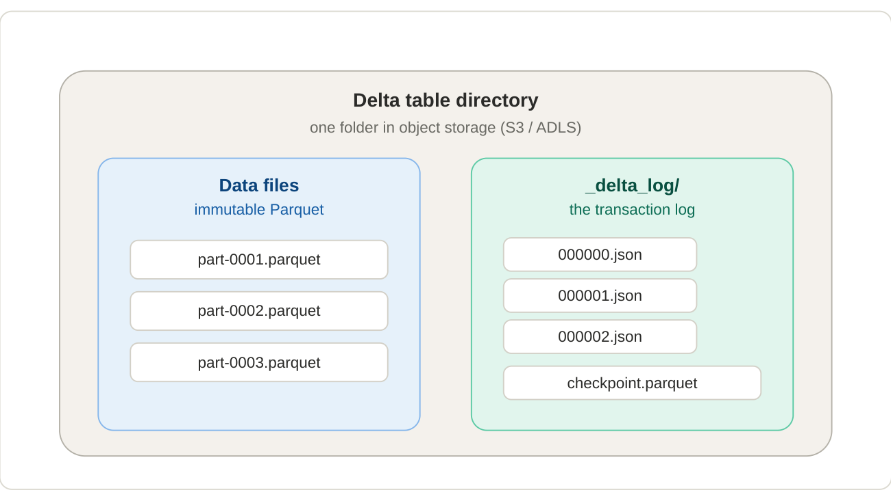

# 2. Delta & Iceberg: the copy-on-write baselines

Paimon is easiest to understand as "Delta, with one big idea swapped out." So first, precisely how Delta works — then a quick look at Iceberg, which is structurally similar.

A Delta table is just a directory containing two kinds of things: immutable Parquet data files, and a `_delta_log/` folder of numbered JSON commits. A commit holds no data — only a small list of actions such as "add file X (with these stats)" and "remove file Y." The commit numbers increase strictly: `000000.json`, `000001.json`, and so on.



*A Delta table = immutable data files + an append-only transaction log that decides which files are live.*

## How a reader reconstructs the table

The current state of a Delta table is **derived**, not stored directly: replay every commit in order, tracking which files have been "added" but not yet "removed." The surviving set of Parquet files is the table right now. The folder might physically hold 50 files while the log says only 12 are live — readers trust the log, never a folder listing. From this you get:

- **Atomicity** — a write only counts once its JSON commit lands; half-written data files are invisible because no commit references them.
- **Time travel / snapshots** — replay the log only up to commit N to see an older version; the old data files are still present, frozen.
- **Optimistic concurrency** — two writers attempt the next commit number; one wins, the other detects the conflict and retries.

Replaying thousands of commits would get slow, so Delta periodically writes a **checkpoint** (a Parquet snapshot of "here is the full set of live files as of commit N"). Readers start from the latest checkpoint and replay only the few commits after it. (Paimon has an analogous idea — snapshots pointing at manifest lists — so the pattern carries over.)

## The defining trait: copy-on-write

Because Parquet files are immutable, Delta cannot edit a single row in place. To change one row, it must:

1. Find the file that contains the row (using the per-file min/max stats in the log).
2. Read that entire file.
3. Write a brand-new file with the one row changed and everything else copied across.
4. Commit: "remove the old file, add the new file."

This is **copy-on-write (COW)**. Reads are trivial and fast — just open the live files, no merging needed — but any write that touches existing rows rewrites whole files.

!!! warning "The villain: write amplification"
    Now imagine a stream delivering thousands of single-row updates per second. Copy-on-write would have Delta rewriting large files continuously — a *tiny logical change* causing a *huge physical write*, over and over. That ratio, **write amplification**, is the exact pain Paimon was built to remove.

## Where Iceberg fits in

**Apache Iceberg** (originally from Netflix, 2018) is the other major table format you'll hear about, and it's structurally a sibling to Delta:

- **Same storage model:** immutable Parquet/ORC/Avro data files in object storage + a metadata layer that decides which files are live.
- **Different metadata structure.** Where Delta has a flat append-only JSON log, Iceberg has a small tree:

```
catalog → metadata.json → snapshot → manifest list (.avro) → manifest files (.avro) → data files
```

Each commit produces a new metadata file pointing at a snapshot, which points at a manifest list, which points at manifest files, which list the actual data files with column-level stats. The extra layer means very large tables (millions of files) can commit without rewriting a huge log.

### Iceberg supports both COW *and* MOR — as do Delta and Paimon

This is the important nuance: **all three formats support both copy-on-write and merge-on-read as configurable modes**. What differs is *how each implements MOR*, and what each is *optimised for*.

| Format  | COW                       | MOR implementation                                                                                  |
|---------|---------------------------|-----------------------------------------------------------------------------------------------------|
| Delta   | Default                   | **Deletion vectors** — bitmaps that mark rows as deleted in a Parquet file, so the file doesn't have to be rewritten. |
| Iceberg | Default (configurable per-op via `write.update.mode`, `write.delete.mode`, `write.merge.mode`) | **Position deletes** and **equality deletes** — small Avro/Parquet files listing which rows in which data files are dead. |
| Paimon  | Available (`full-compaction.delta-commits = 1`) | **LSM tree** — new versions land in tiny files and are organised into levels; compaction runs in the background. Built for continuous high-frequency churn. |

Delta's deletion vectors and Iceberg's delete files both reduce write amplification compared to pure COW — a single-row update no longer rewrites the whole data file. But neither was *engineered* for continuous streaming churn the way Paimon's LSM tree was: in Delta/Iceberg, MOR is essentially a delete-marker bolted on top of a write-once file layout. In Paimon, MOR is the *primary* design — buckets, levels, sorted runs, sequence numbers, and background compaction all exist to make it work at high frequency.

### What else Iceberg brings

- **Hidden partitioning** — partition values are *derived* from columns (e.g. `days(event_time)`), so queries don't need to know the partition column to be efficient. Delta requires the query to reference the literal partition column.
- **Partition evolution** — change the partition spec without rewriting data. Unique to Iceberg among the three.
- **Schema evolution by column ID** — rename/reorder columns safely. Delta does this by position+name.
- **Branches & tags** — git-like named snapshots (added in Iceberg 1.2). Paimon copied this model.

### The takeaway for this primer

For the purposes of understanding Paimon's contribution, **Delta and Iceberg are on the same side of the line**: both designed first for batch analytics, with COW as the primary mode and MOR added on as a delete-marker mechanism. Iceberg has the richer metadata tree and stronger multi-engine story; Delta has tighter Databricks integration. **Paimon flips the priority** — MOR is the default mode and the storage layout (LSM tree, buckets, levels) is engineered for it from the ground up. That's Section 3.
