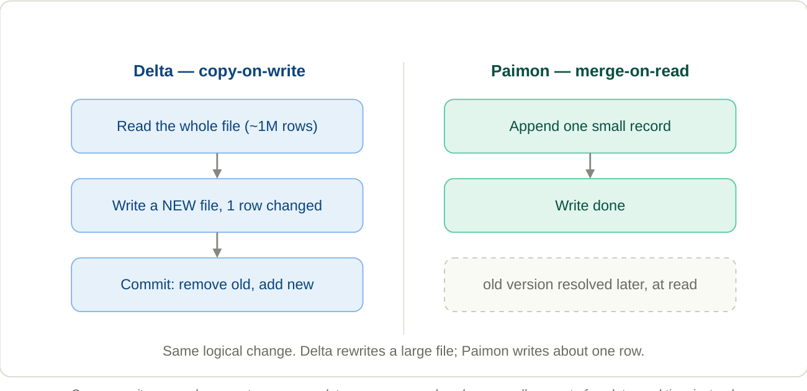

# 3. The fundamental trade-off: copy-on-write vs merge-on-read

**Everything distinctive about Paimon comes from one swap in *when* you pay the cost.**

Delta's instinct is to do the work at write time so reads stay simple (copy-on-write). Paimon's instinct is the opposite: never rewrite — append the change as a tiny new file, and resolve "which version wins" later, at read time. That is **merge-on-read (MOR)**, and it is Paimon's default.

*Same logical change. Delta rewrites a large file; Paimon writes about one row.*

Copy-on-write pays a large cost on every update; merge-on-read pushes a small amount of work to read time instead. When order #555 changes to `shipped`, Paimon writes one tiny record ("PK 555 → shipped, sequence 9001") into a small new file. The old `pending` version still physically exists; at read time Paimon keeps the newest. Write amplification essentially vanishes. The cost didn't disappear, though — it moved to the read path (you now have to merge versions) and to background compaction (covered in Sections 6–7). The genius is that this moved cost is cheap and amortized, whereas Delta's was expensive and synchronous on every write.

!!! info "The mirror image"
    Delta pays at *write* so reads are trivial. Paimon pays a little at *read* so writes are trivial. Neither is "better" in the abstract — they're tuned for opposite workloads. **Delta** suits batch-heavy, append-mostly analytics; **Paimon** suits high-frequency streaming updates by primary key.
