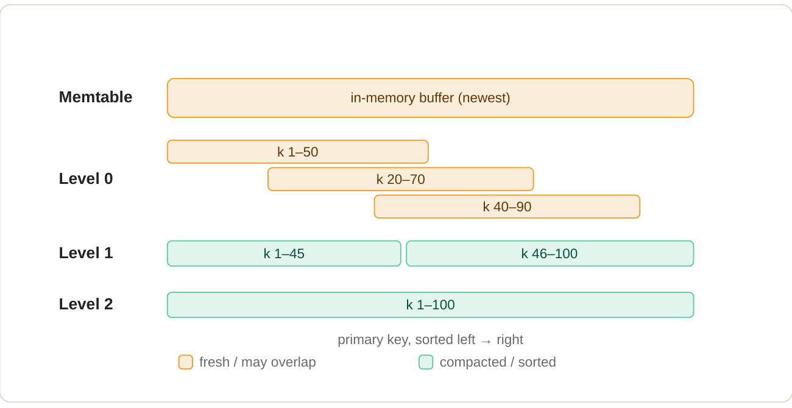

# 4. Inside Paimon: buckets, the LSM tree, sorted runs & levels

**If every update just drops a tiny new file, what stops reads from drowning in millions of files? An LSM tree.**

Merge-on-read only works because Paimon organises those small files using a **log-structured merge-tree (LSM tree)**, the same structure databases like RocksDB and Cassandra use. Two structural facts come first.

## Buckets — the unit of parallelism

A table (or each partition of it) is divided into a fixed number of **buckets** by hashing the primary key (or a chosen bucket key). Each bucket is an independent LSM tree. Because a given key is hashed to a fixed bucket, every version of that key lives together in one bucket. The bucket count caps write/read parallelism: a bucket is the smallest unit of work. Too few buckets throttles throughput; too many creates lots of small files.

## The memtable — where writes land first

New writes first go into an in-memory buffer (the **memtable**), sorted by primary key. When the writing engine checkpoints, the memtable is flushed to disk as a small sorted file. Notably, **Paimon keeps no write-ahead log** — it relies on the compute engine's checkpoint mechanism to recover any in-memory data after a failure. (This is the one place the engine, e.g. Flink, is structurally relevant.)

## Levels and sorted runs

Within a bucket, data files are arranged into numbered **levels**, organised as **sorted runs**. A sorted run is a set of files where the key ranges *do not overlap*; within each file, rows are sorted by primary key.

*One bucket's LSM tree. Fresh files (Level 0) can overlap on the key axis; compacted files (Level 1+) are sorted and non-overlapping.*

Read the diagram top-to-bottom as "newest & messy → oldest & tidy":

- **Level 0** holds freshly flushed files. Their key ranges can overlap — key #45 might appear in several of them (Section 5 explains why).
- **Level 1 and below** are produced by compaction. Within each level the runs are sorted and their key ranges are disjoint, so a given key sits in at most one file per level.

Different sorted runs can still cover the same key with different versions — which is exactly what makes the read path a merge, and the next two sections walk through it.
