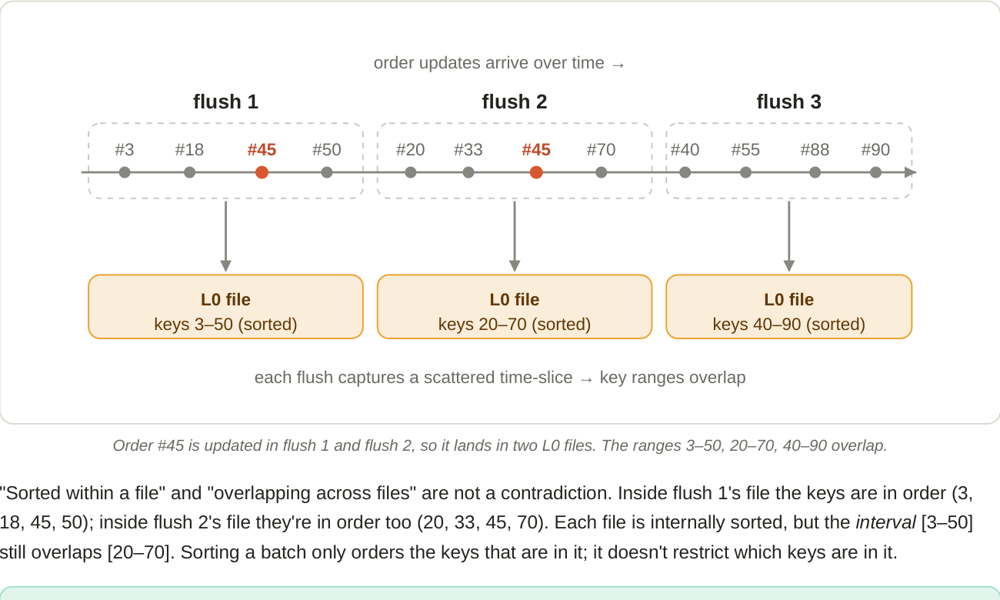

# 5. Why Level 0 files overlap

**The key insight: Paimon flushes files by *time*, not by *key range*.**

Each Level 0 file is a snapshot of "whatever keys happened to be written in the last little while." Since any key can be written at any moment — a customer can update order #45 whenever, independently of #3 or #90 — each flush captures a random scatter of keys spanning the whole key space. Two such time-slices therefore overlap as key ranges.

*Order #45 is updated in flush 1 and flush 2, so it lands in two L0 files. The ranges 3–50, 20–70, 40–90 overlap.*

"Sorted within a file" and "overlapping across files" are not a contradiction. Inside flush 1's file the keys are in order (3, 18, 45, 50); inside flush 2's file they're in order too (20, 33, 45, 70). Each file is internally sorted, but the *interval* [3–50] still overlaps [20–70]. Sorting a batch only orders the keys that are in it; it doesn't restrict which keys are in it.

!!! info "Why tolerate the mess?"
    Merging on every flush would *be* copy-on-write again — expensive, on the hot path. Paimon instead accepts a little temporary overlap in Level 0 (cheap writes) and lets background compaction re-partition the key space into the clean, disjoint ranges of Level 1+.
