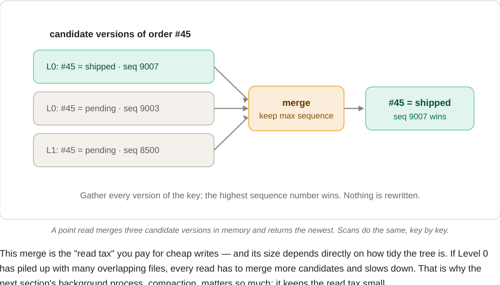

# 6. The read path: merge-on-read in action

**Reading a key isn't "open one file" — it's "gather every version and pick the winner."**

To return order #45, Paimon checks the memtable and every level that could contain it. Because Level 1+ runs are sorted and non-overlapping, the key sits in *at most one file per level* there, so most files are skipped; only the overlapping Level 0 needs all-files checking. Every version found is collected, and the one with the highest sequence number wins (Section 8). Crucially, this happens entirely in memory at query time — nothing on disk is rewritten.

*A point read merges three candidate versions in memory and returns the newest. Scans do the same, key by key.*

This merge is the "read tax" you pay for cheap writes — and its size depends directly on how tidy the tree is. If Level 0 has piled up with many overlapping files, every read has to merge more candidates and slows down. That is why the next section's background process, **compaction**, matters so much: it keeps the read tax small.

!!! tip "Why Paimon reads by primary key are fast anyway"
    Because data is sorted by key within files and partitioned cleanly across Level 1+, Paimon can use per-file key ranges and indexes to skip almost everything when you filter on the primary key. The merge cost is bounded by *how many overlapping runs cover the key*, not by table size.
