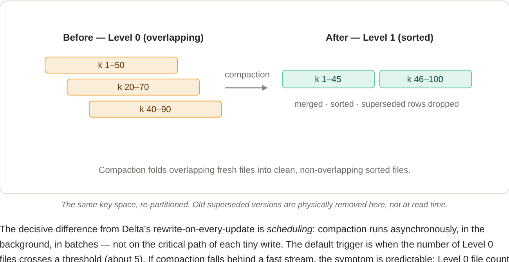
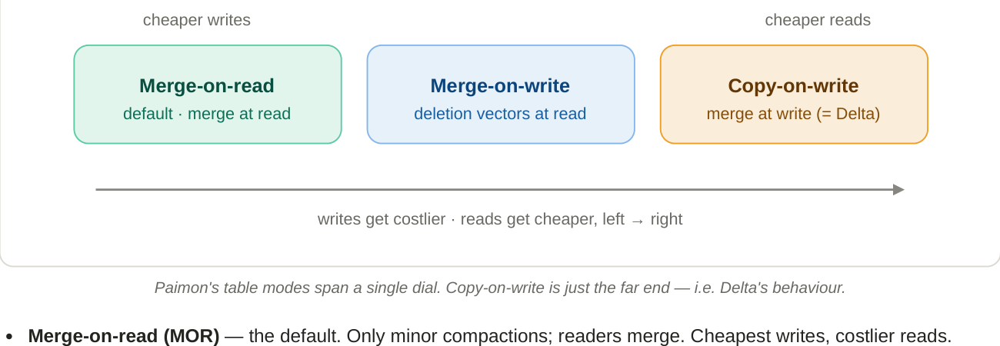

# 7. Compaction & the table modes (MOR / MOW / COW)

**Compaction is the background janitor that keeps the read tax from growing without bound.**

Compaction takes a pile of small, overlapping files (especially in Level 0), merges them, discards superseded versions, re-sorts by key, and writes the result down into a deeper, tidy level with non-overlapping ranges.

*The same key space, re-partitioned. Old superseded versions are physically removed here, not at read time.*

The decisive difference from Delta's rewrite-on-every-update is *scheduling*: compaction runs **asynchronously, in the background, in batches** — not on the critical path of each tiny write. The default trigger is when the number of Level 0 files crosses a threshold (about 5). If compaction falls behind a fast stream, the symptom is predictable: Level 0 file count climbs and reads slow down. That is why **"Level 0 files per bucket"** is the single most-watched health metric on streaming Paimon tables.

!!! info "Merge vs Compaction — two separate mechanisms"
    **Merge (at read):** gather a key's versions, pick the max sequence number, in memory, rewrite nothing.
    **Compaction (background):** physically merge files and delete the losers on disk, later.
    Both resolve superseded versions — one transiently per query, one durably.

## The three table modes — it's a dial

How aggressively Paimon compacts is configurable, and it sets where you sit on the write-cost / read-cost spectrum.

*Paimon's table modes span a single dial. Copy-on-write is just the far end — i.e. Delta's behaviour.*

- **Merge-on-read (MOR)** — the default. Only minor compactions; readers merge. Cheapest writes, costlier reads.
- **Merge-on-write (MOW)** — enable deletion vectors (`deletion-vectors.enabled = true`). Paimon marks superseded rows so readers can filter them out without merging. A middle ground: writes stay reasonable, reads get much faster.
- **Copy-on-write (COW)** — force a full merge on every commit (`full-compaction.delta-commits = 1`). Reads are fastest (everything already merged), writes are slowest. This is effectively Delta's model.

!!! success "The aha"
    Paimon is a **superset**: copy-on-write — Delta's whole strategy — is simply one extreme setting of Paimon's compaction dial. But Paimon can *also* sit at the cheap-streaming-write end, which Delta fundamentally cannot, because Delta has no LSM tree to absorb the churn.
