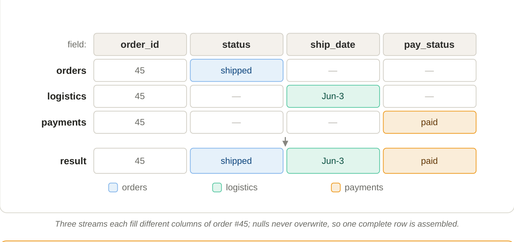

# 9. Merge engines: how same-key records combine

**"Newest wins" is only the default.** The **merge engine** — a table property — decides *how* same-key records combine into one surviving row.

## 1. `deduplicate` (default)

Keep the latest record, throw away the rest. If the latest record is a `-D`, the key is deleted (configurable via `ignore-delete`). This is the **"mirror a source table"** engine: a CDC stream lands here and the Paimon table equals the source's current state, row for row.

## 2. `partial-update` — assemble a wide row from many sources

Each column is filled independently using the latest value, and **null values do not overwrite existing values**. Multiple streams can each contribute their slice of one wide row over time — effectively a "join by primary key, accumulated by the storage layer," with no actual join.



*Three streams each fill different columns of order #45; nulls never overwrite, so one complete row is assembled.*

!!! warning "`partial-update` gotchas"
    - **Cannot accept deletes by default.** Choose `ignore-delete`, `partial-update.remove-record-on-delete` (drop the whole row), or sequence-group retraction. A delete from one source is ambiguous — blank that source's columns, drop the whole row, or ignore? — so you must say which.
    - **Multi-stream ordering needs sequence-groups.** A single table-wide sequence field can let one stream's stale data overwrite another's; give each source its own ordering column with `fields.<g>.sequence-group`.
    - **Streaming reads require a `lookup` or `full-compaction` changelog producer** (Section 10).

## 3. `aggregation` — maintain live rollups

Each non-key column is assigned an aggregate function and records fold into a running result — perfect for a summary layer where metrics are maintained by the storage engine instead of a batch job. Columns without an explicit function default to `last_non_null_value`.

```sql
-- live per-product rollup
CREATE TABLE product_stats (
  product_id  BIGINT,
  max_price   DOUBLE,
  total_sales BIGINT,
  PRIMARY KEY (product_id) NOT ENFORCED
) WITH (
  'merge-engine' = 'aggregation',
  'fields.max_price.aggregate-function'   = 'max',
  'fields.total_sales.aggregate-function' = 'sum'
);
-- writing (1, 23.0, 15) then (1, 30.2, 20)  →  result (1, 30.2, 35)
```

Common functions include `sum`, `product`, `count`, `max`, `min`, `first_value` / `first_non_null_value`, `last_value` / `last_non_null_value`, `listagg`, `bool_and` / `bool_or`, `collect`, `merge_map`, plus approximate-distinct sketches (`hll_sketch`, `theta_sketch`).

!!! warning "Retraction matters"
    Only a subset of functions can "undo" an old value when an update/delete arrives — `sum`, `product`, `count`, `collect`, `merge_map`, `last_value`, `last_non_null_value` support retraction; others (e.g. `max`, `min`) cannot un-see a value. For columns that should ignore retraction, set `fields.<name>.ignore-retract = 'true'`. Choose functions that match whether your stream has updates/deletes.

## 4. `first-row` — keep the first, ignore the rest

The mirror image of `deduplicate`: keep the **first** record seen for each key and ignore all later ones, producing an insert-only changelog. Ideal for de-duplicating noisy append/event streams (e.g. "first event per `event_id`, drop replays"). It doesn't accept deletes, and Level 0 files become visible only after compaction — so its latency profile differs from the others.

## Picking one

| Use case                                                | Merge engine     |
|---------------------------------------------------------|------------------|
| Mirror a source DB table (full CDC, updates + deletes)  | `deduplicate`    |
| Assemble a wide entity row from multiple systems        | `partial-update` |
| Maintain live rollups / metrics (sum, count, last)      | `aggregation`    |
| De-duplicate a noisy append / event stream              | `first-row`      |
