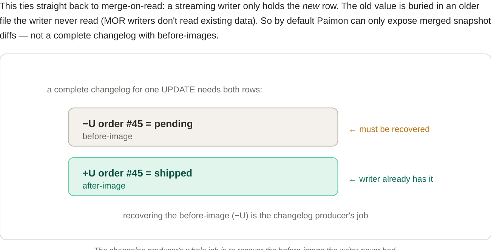

# 10. Changelog producers: emitting a correct CDC stream

**A primary-key table can emit its own change stream — a binlog of the table's evolution — for downstream consumers.**

A **changelog** is a stream of row-level changes. For an update it needs both the **before-image** (`-U`) and **after-image** (`+U`), because downstream streaming operators — aggregations, joins — must "retract" the old value before applying the new one. If an order total changes 100 → 150, a downstream `SUM` needs to subtract 100 and add 150. Without the before-image, it can't do that correctly.

## Why before-images aren't free

This ties straight back to merge-on-read: a streaming writer only holds the *new* row. The old value is buried in an older file the writer never read (MOR writers don't read existing data). So **by default Paimon can only expose merged snapshot diffs** — not a complete changelog with before-images.

*The changelog producer's whole job is to recover the before-image the writer never had.*

## The four producers

| Producer          | How it recovers before-images                                              | When to use                                                                                                       |
|-------------------|----------------------------------------------------------------------------|-------------------------------------------------------------------------------------------------------------------|
| `none` *(default)*| It doesn't — only merged snapshot diffs are exposed.                       | Batch reads only (batch never needs a changelog).                                                                 |
| `input`           | Forwards the raw input records as the changelog (a dual write).            | The input is already a complete changelog (e.g. database CDC) and the engine is `deduplicate`. Cheapest correct option. |
| `lookup`          | Looks up the old value before commit and emits correct −U/+U pairs.        | Low-latency complete changelog, or when the input can't be trusted. Resource-hungry.                              |
| `full-compaction` | Diffs the results of consecutive full compactions.                         | Latency of minutes is acceptable; cheaper, decoupled from the write path.                                         |

## Two sharp edges

- **`input` is a pass-through, not a reconciler.** It is only correct when the table is a `deduplicate` mirror of an already-complete source changelog. The moment the engine transforms data (`partial-update`, `aggregation`), the input no longer equals the table's real change — switch to `lookup`.
- **`full-compaction` is "complete" only at `delta-commits = 1`.** With a larger value, intermediate changes between compactions are collapsed into net changes rather than every change.

!!! warning "Cost warning"
    Enabling any changelog producer **significantly reduces compaction/write performance**. Only turn one on when a downstream *streaming* consumer genuinely needs the change stream — pure batch consumers never do.
